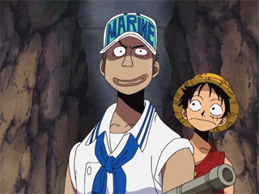

Olá! Eu sou o **Maurilio Mounie** / Hello! I'm **Maurilio Mounie** 🤘

 
 

### Me:

          

<!---
emiemi17/emiemi17 is a ✨ special ✨ repository because its `README.md` (this file) appears on your GitHub profile.
You can click the Preview link to take a look at your changes.
--->
